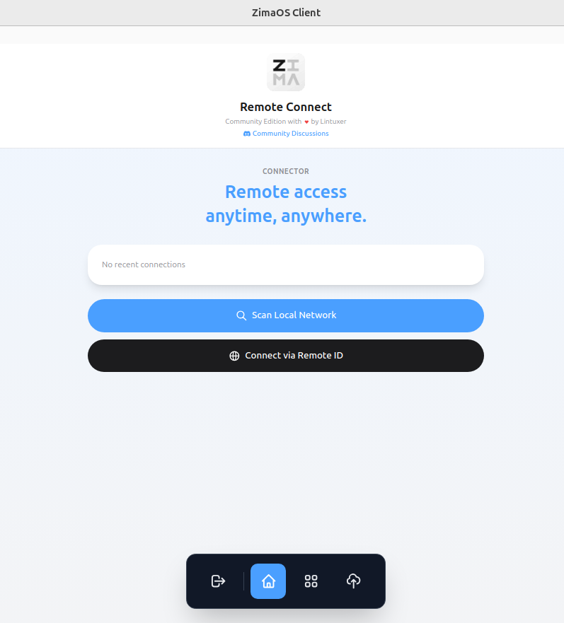
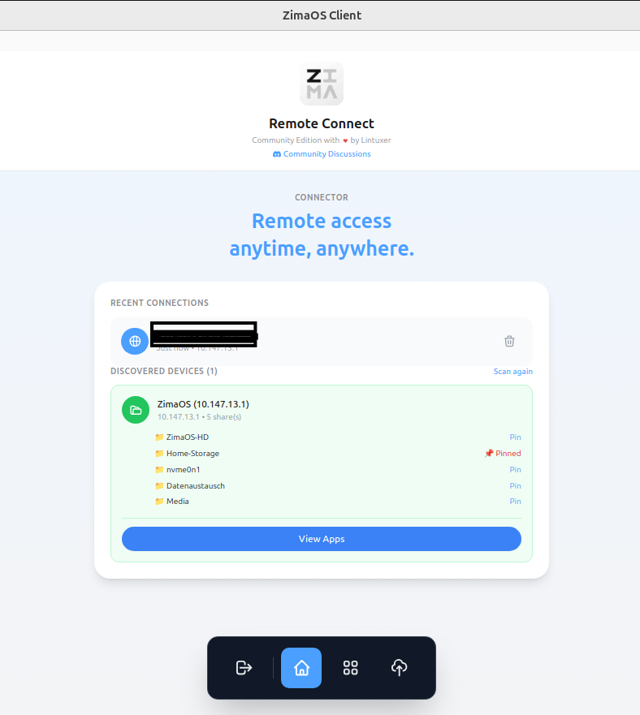
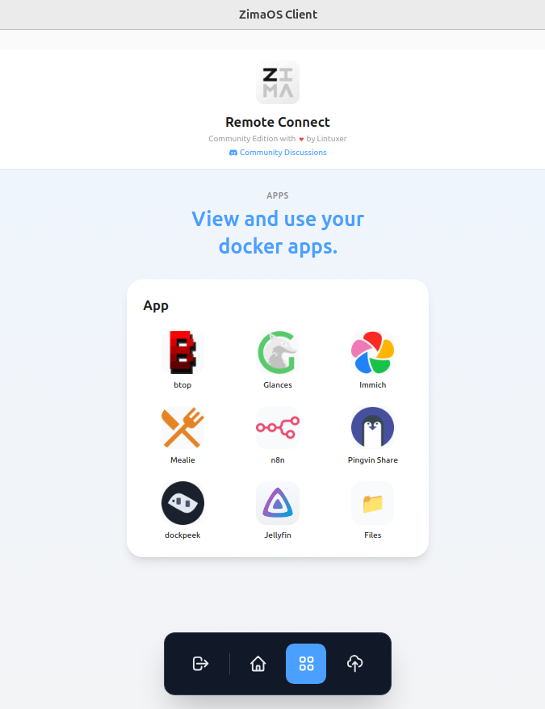
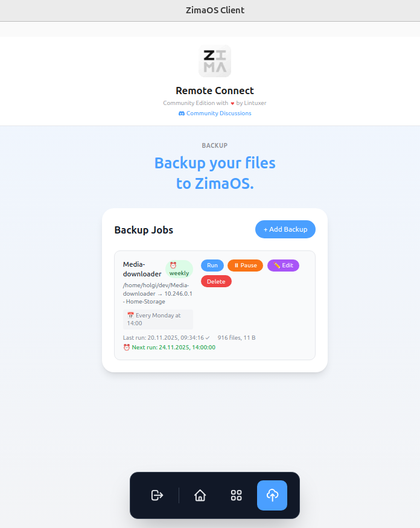

# ZimaOS Client

Modern Desktop Client for ZimaOS with integrated ZeroTier and SMB management.

## English

### Overview

ZimaOS Client is a powerful desktop application for Linux and macOS that provides seamless connectivity to your ZimaOS devices. Connect to your personal cloud storage, access Docker applications, and manage automated backups - all from a native desktop client.

### Features

- **Remote Connectivity**: Connect to ZimaOS devices via local network or remote ID using ZeroTier
- **SMB/CIFS Integration**: Browse and access shared folders with automatic mounting
- **Docker App Management**: View and access your ZimaOS Docker applications directly from the client
- **Automated Backups**: Schedule and manage automated backup jobs from local folders to ZimaOS shares
- **Recent Connections**: Quick access to previously connected devices
- **Network Discovery**: Automatic discovery of ZimaOS devices on your local network
- **ZeroTier Diagnostics**: Built-in diagnostic tools to troubleshoot connectivity issues
- **Settings Management**: Configure language, theme, ZeroTier options, and backup preferences
- **Dark Mode**: Full dark mode support with system theme detection

### Screenshots

#### Connection Screen


#### Device Discovery & Shares


#### Docker Apps


#### Backup Management


### Installation

#### Linux

Download the latest release from the [releases page](https://github.com/chicohaager/zima-linux-client/releases).

**AppImage:**
```bash
chmod +x ZimaOS\ Client-*.AppImage
./ZimaOS\ Client-*.AppImage
```

**Debian/Ubuntu (.deb):**
```bash
sudo dpkg -i zima-linux-client_*_amd64.deb
sudo apt-get install -f  # Install dependencies if needed
```

#### macOS

Download the latest macOS release from the [releases page](https://github.com/chicohaager/zima-linux-client/releases).

### Building from Source

#### Prerequisites

- Node.js 18 or higher
- npm or yarn
- Git

#### Build Steps

```bash
# Clone the repository
git clone https://github.com/chicohaager/zima-linux-client.git
cd zima-linux-client

# Install dependencies
npm install

# Development mode
npm run dev

# Build for production
npm run build

# Package for your platform
npm run package:linux  # Linux (AppImage + DEB)
npm run package:mac    # macOS
```

### Requirements

- **Linux**: libfuse2, smbclient
- **ZeroTier**: Automatically installed during package installation

### Usage

1. **Launch the application**
2. **Connect to your ZimaOS**:
   - Use "Scan Local Network" to find devices on your local network
   - Use "Connect via Remote ID" to connect remotely using ZeroTier
3. **Access your shares**: Browse and mount SMB shares from discovered devices
4. **Manage apps**: View and access your Docker applications
5. **Setup backups**: Create scheduled backup jobs to protect your data

### Troubleshooting

**Connection issues?**

The app includes built-in diagnostics to help troubleshoot ZeroTier connectivity:

1. **Open Settings** (gear icon in top-right corner)
2. Navigate to the **ZeroTier** tab
3. Click **Run Diagnostics** to check:
   - ZeroTier binary existence and permissions
   - Service status
   - Network connectivity
   - Port availability
   - System configuration

**Common solutions:**
- **Log out and back in** after installation (group permissions need a fresh login)
- Check ZeroTier service: `sudo systemctl status zima-zerotier.service`
- Review diagnostic results in Settings > ZeroTier > Diagnostics

### Development

```bash
# Run tests
npm test

# Run tests in watch mode
npm run test:watch

# Check test coverage
npm run test:coverage

# Lint code
npm run lint

# Type checking
npm run type-check
```

### License

MIT License - see LICENSE file for details

### Author

Holger Kühn

---

## Deutsch

### Übersicht

ZimaOS Client ist eine leistungsstarke Desktop-Anwendung für Linux und macOS, die nahtlose Konnektivität zu Ihren ZimaOS-Geräten bietet. Verbinden Sie sich mit Ihrem persönlichen Cloud-Speicher, greifen Sie auf Docker-Anwendungen zu und verwalten Sie automatisierte Backups - alles von einem nativen Desktop-Client aus.

### Funktionen

- **Remote-Konnektivität**: Verbindung zu ZimaOS-Geräten über lokales Netzwerk oder Remote-ID mit ZeroTier
- **SMB/CIFS-Integration**: Durchsuchen und Zugriff auf freigegebene Ordner mit automatischem Mounten
- **Docker-App-Verwaltung**: Anzeigen und Zugriff auf Ihre ZimaOS Docker-Anwendungen direkt vom Client aus
- **Automatisierte Backups**: Planen und Verwalten von automatisierten Backup-Jobs von lokalen Ordnern zu ZimaOS-Freigaben
- **Letzte Verbindungen**: Schnellzugriff auf zuvor verbundene Geräte
- **Netzwerk-Erkennung**: Automatische Erkennung von ZimaOS-Geräten in Ihrem lokalen Netzwerk
- **ZeroTier-Diagnose**: Integrierte Diagnosetools zur Fehlerbehebung bei Verbindungsproblemen
- **Einstellungsverwaltung**: Konfiguration von Sprache, Theme, ZeroTier-Optionen und Backup-Einstellungen
- **Dark Mode**: Vollständige Dark-Mode-Unterstützung mit System-Theme-Erkennung

### Screenshots

#### Verbindungsbildschirm


#### Geräteerkennung & Freigaben


#### Docker Apps


#### Backup-Verwaltung


### Installation

#### Linux

Laden Sie die neueste Version von der [Releases-Seite](https://github.com/chicohaager/zima-linux-client/releases) herunter.

**AppImage:**
```bash
chmod +x ZimaOS\ Client-*.AppImage
./ZimaOS\ Client-*.AppImage
```

**Debian/Ubuntu (.deb):**
```bash
sudo dpkg -i zima-linux-client_*_amd64.deb
sudo apt-get install -f  # Abhängigkeiten installieren falls nötig
```

#### macOS

Laden Sie die neueste macOS-Version von der [Releases-Seite](https://github.com/chicohaager/zima-linux-client/releases) herunter.

### Aus Quellcode erstellen

#### Voraussetzungen

- Node.js 18 oder höher
- npm oder yarn
- Git

#### Build-Schritte

```bash
# Repository klonen
git clone https://github.com/chicohaager/zima-linux-client.git
cd zima-linux-client

# Abhängigkeiten installieren
npm install

# Entwicklungsmodus
npm run dev

# Für Produktion erstellen
npm run build

# Für Ihre Plattform paketieren
npm run package:linux  # Linux (AppImage + DEB)
npm run package:mac    # macOS
```

### Anforderungen

- **Linux**: libfuse2, smbclient
- **ZeroTier**: Wird automatisch bei der Paketinstallation installiert

### Verwendung

1. **Starten Sie die Anwendung**
2. **Verbinden Sie sich mit Ihrem ZimaOS**:
   - Verwenden Sie "Scan Local Network", um Geräte in Ihrem lokalen Netzwerk zu finden
   - Verwenden Sie "Connect via Remote ID", um sich remote über ZeroTier zu verbinden
3. **Greifen Sie auf Ihre Freigaben zu**: Durchsuchen und mounten Sie SMB-Freigaben von entdeckten Geräten
4. **Verwalten Sie Apps**: Anzeigen und Zugriff auf Ihre Docker-Anwendungen
5. **Richten Sie Backups ein**: Erstellen Sie geplante Backup-Jobs zum Schutz Ihrer Daten

### Fehlerbehebung

**Verbindungsprobleme?**

Die App enthält integrierte Diagnosetools zur Fehlerbehebung bei ZeroTier-Verbindungen:

1. **Einstellungen öffnen** (Zahnrad-Symbol oben rechts)
2. Zum Tab **ZeroTier** navigieren
3. **Diagnose ausführen** klicken, um zu prüfen:
   - ZeroTier-Binary-Existenz und -Berechtigungen
   - Service-Status
   - Netzwerkkonnektivität
   - Port-Verfügbarkeit
   - Systemkonfiguration

**Häufige Lösungen:**
- **Abmelden und wieder anmelden** nach der Installation (Gruppenberechtigungen erfordern einen neuen Login)
- ZeroTier-Service prüfen: `sudo systemctl status zima-zerotier.service`
- Diagnoseergebnisse in Einstellungen > ZeroTier > Diagnostics überprüfen

### Entwicklung

```bash
# Tests ausführen
npm test

# Tests im Watch-Modus ausführen
npm run test:watch

# Test-Abdeckung prüfen
npm run test:coverage

# Code-Linting
npm run lint

# Typ-Prüfung
npm run type-check
```

### Lizenz

MIT-Lizenz - siehe LICENSE-Datei für Details

### Autor

Holger Kühn
