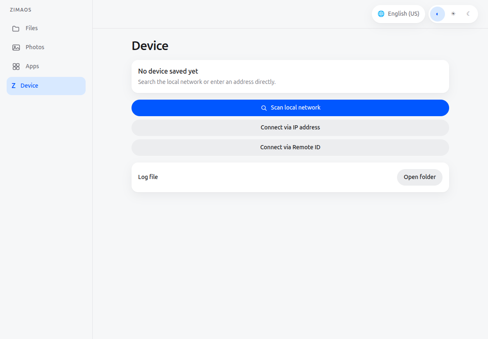
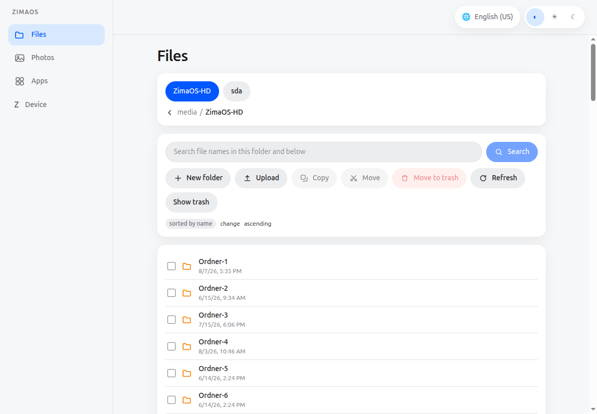
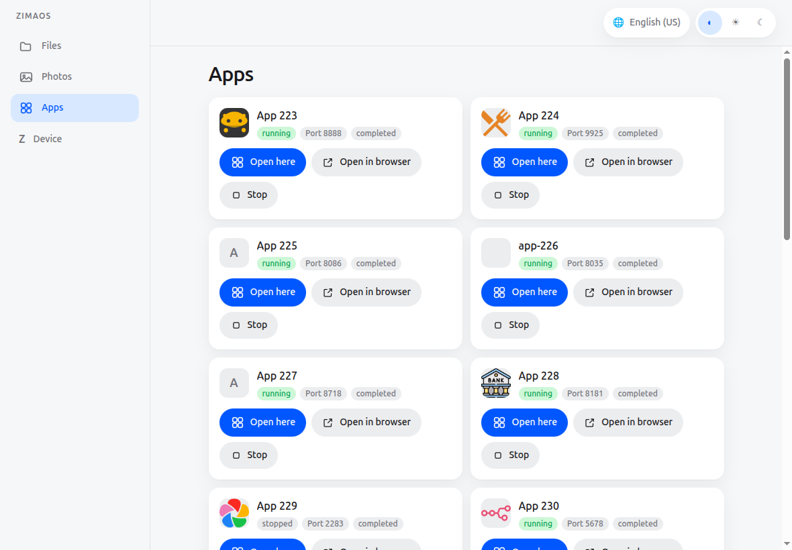
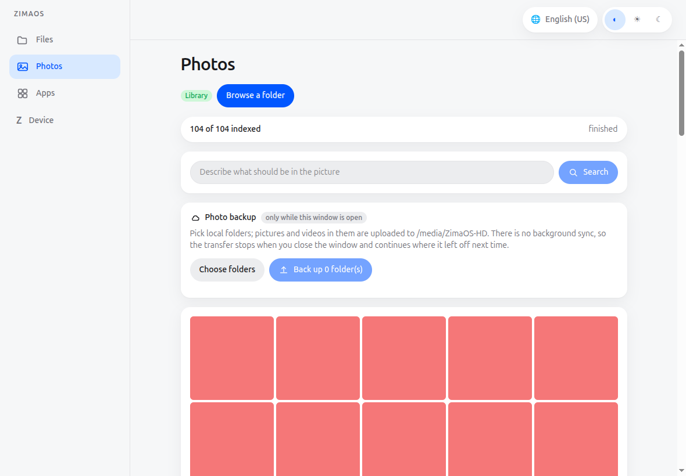
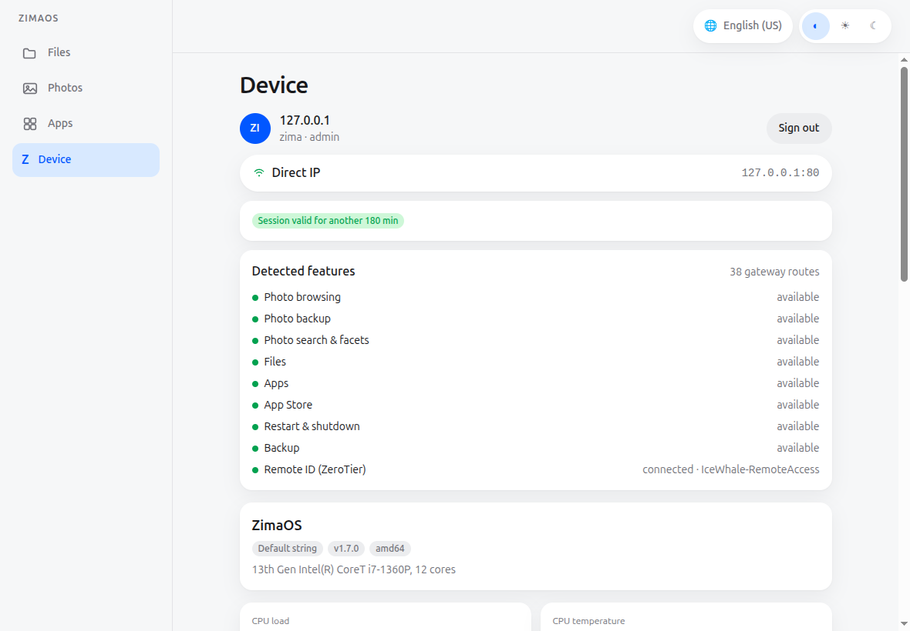
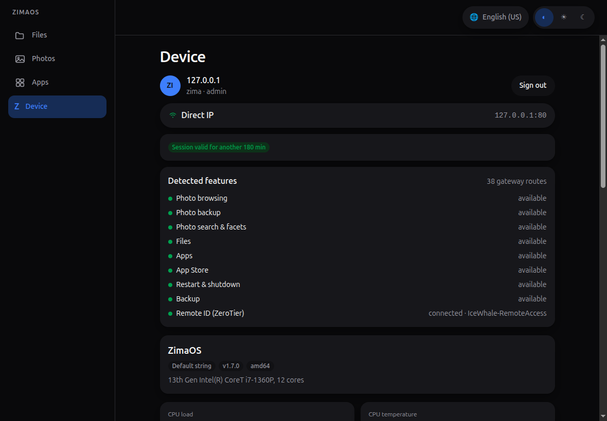
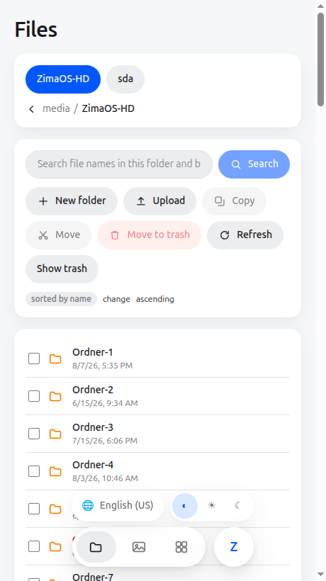

# ZimaOS Client

Desktop client for ZimaOS on Linux — files, photos, apps and device management, with ZeroTier
built in and Tailscale used when it is already there.

> **This is the `v2` branch: version 2.0.0-alpha.4, a rewrite.**
> The latest **published** package is
> [`v2.0.0-alpha.4`](https://github.com/chicohaager/zima-linux-client/releases/tag/v2.0.0-alpha.4).
> The installed package has been started on **nine distributions** (Ubuntu 22.04, 24.04 and
> 26.04 LTS, Debian 12 and 13, Fedora 41 and 44, Arch, openSUSE Tumbleweed) — in containers,
> under Xvfb, x86_64 only.
> On a **real desktop** it has been used on two machines: Ubuntu 24.04 (GNOME on Wayland) and
> **Zorin OS 18**, where alpha.4 was taken through by hand — the client came up with no session
> and reached out to nothing on its own, **Connect** restored the session from the stored token
> without asking for a password, and files, photos and apps worked over both ZeroTier and
> Tailscale.
> On top of that there is a **third-party report** (2026-08-11, ZimaSpace forum): a tester
> installed alpha.4 from the `.rpm` on a **Fedora KDE Plasma workstation** and used it for about
> 15 minutes — it started and reached the device while signed in; one message in the Photos tab
> was reported
> ([V2-STATUS, German](docs/V2-STATUS.md#fremdbericht-fedora-kde)).
> A forum post is not a measurement protocol: the Fedora release, the session type, the SELinux
> mode and the keyring are not in it.
> What that does **not** cover: openSUSE and Arch on real hardware, everything the Fedora report
> does not name, and therefore still Wayland on one measured driver only, SELinux, and any keyring
> but GNOME's.
> The 0.9.x line lives on `main` and under [`legacy-0.9/`](legacy-0.9/); nothing was deleted.
>
> What is built and what is measured: [`docs/V2-STATUS.md`](docs/V2-STATUS.md)
> Deutsche Fassung dieser Datei: [`liesmich.md`](liesmich.md)

Every claim in this repository's documentation names the command or the measurement behind it.
Where something is unmeasured, it says so instead of sounding finished.

---

## Screenshots

All pictures below come from the real build, taken by `npm run screenshots`, against the recorded
device the end-to-end suite replays. Nothing is staged and nothing is retouched — see
[About these pictures](#about-these-pictures) for what that recording can and cannot show.

**Three ways in, side by side** — scan the network, type an address, or hand it a Remote ID.



**Files** — browse, search, upload, download, transfer tasks, trash with restore, pinned folders.



**Apps** — what is installed, with its own icon, its port and its state.



**Photos** — the library, the device's indexing progress, and a foreground backup of local folders.



The flat colour tiles are not a rendering fault: the recorded device serves placeholder image
bytes, because a fixture that carried real photographs would carry somebody's real photographs.

**Device** — model, system state, detected features, session validity. The same screen in both
themes, because "follow the system" is a state of its own here, not a two-way toggle.





**Two layouts, one information architecture** — a floating pill below 860 px, a labelled sidebar
above it. Two component trees, not one restyled.



### About these pictures

- **The device is a recording**, `e2e/fixtures/zimaos-session.json`, scrubbed by
  `e2e/scrub-fixture.mjs`: file and folder names are replaced wholesale, addresses, e-mail
  addresses and tokens rewritten. That is why the folders are called `Ordner-1` and the apps
  `App 223` — those pictures cannot show anyone's real files, because the only device involved
  has none.
- **The red panel is true, and it is about the capture machine, not about the program.** The
  headless host that takes these pictures has no keyring, so Electron would fall back to storing
  credentials with a hardcoded password — and the client says so **before** anything is written,
  rather than saving quietly. On a desktop with a working keyring the same panel reads
  "Credentials are protected by …".
- **The capture runs with an empty home directory and without Tailscale on `PATH`**, and a guard
  refuses to write any picture that shows an address other than the replayed one, a tailnet, or a
  home path. It is not a habit of checking; it is
  [`scripts/screenshot-guard.mjs`](scripts/screenshot-guard.mjs), and it has its own tests.

---

## Overview

ZimaOS Client connects a Linux desktop to ZimaOS devices — over the local network, a direct IP
address, or a Remote ID. It browses files, shows the photo library, lists installed apps and
reports the device's state.

## What it does

**Getting in — three ways, side by side**

- **Scan the local network** — mDNS over `_zimaos._tcp` (port 80, TXT `os=ZimaOS`), implemented
  directly against the wire format, no third-party dependency.
- **Connect by IP address** — for devices the scan does not reach.
- **Connect by Remote ID** — the device's ZeroTier network ID. Joining the network, deriving the
  device address and probing it happens in one step; the ZeroTier part is machinery, not a step
  you perform by hand.

Every candidate address — discovered, typed or derived — goes through the same probe, and the
result carries a measured latency. A named reason comes back instead of an empty list, because
"empty" reads like "no device found".

**Once connected**

- **Files** — browse, search, create folders, upload and download, transfer tasks, trash with
  restore, pinned folders.
- **Photos** — gallery and folder grid, search, the device's indexing progress, and a foreground
  backup of local folders. It runs only while the window is open, says so on screen, and lists
  every skipped file with its reason.
- **Apps** — installed apps with their own icons, start and stop, open the web UI.
- **Device** — model and system info, CPU/memory utilisation, volumes, power actions.
- **Several devices** — a registry with priorities, switching, and forgetting a device including
  its session.
- **Import from 0.9** — reads the old client's configuration **read-only**. No secrets are
  migrated: moving a password between keyring backends without asking is a silent trust breach,
  so v2 asks for it once instead.

**Around all of that**

- **28 languages**, 292 keys in the reference. `en_US` and `de_DE` are complete; the other 26
  sit at 287 — the five `apps.window.*` strings added on 2026-08-15 exist in those two only and
  fall back to English elsewhere, which the i18n gate permits and reports rather than hides.
  Only `de_DE`, `en_US` and `en_GB` have been reviewed; the other 25 are machine-translated and
  marked "unreviewed" in the language menu.
- **Light, dark, or follow the system** — three states, not a two-way toggle, so "follow the
  system" stays reachable.
- **Two layouts, one information architecture**: a floating pill below 860 px, a labelled
  sidebar above it — two component trees, not one restyled.
- **ZeroTier ships with the client**, as its own binary under
  `/opt/ZimaOS Client/resources/zerotier/<arch>/`, granted `CAP_NET_ADMIN` during installation.
  Nothing is downloaded, and an existing system-wide ZeroTier is left untouched.
- **Tailscale is detected, never operated.** If a tunnel is already running it is used. Nothing
  is started, stopped or reconfigured, and no DNS setting is touched — the official client takes
  ZeroTier over for its remote access and displaces the DNS the user configured, and a client
  that seizes the tunnel makes that choice for you.

## What it deliberately does not do

- **No background synchronisation.** Photo backup runs while the window is open, and stops with it.
- **No SMB/CIFS mounting and no scheduled backup jobs.** Both existed in the 0.9 line and are
  not part of this rewrite.
- **No automatic updates.** A new version arrives as a new package.
- **It does not take over your tunnel.** See Tailscale above.
- **It does not connect on its own.** A saved device is reached when you press **Connect** and
  not before — nothing reaches out to a tunnel at start-up. Opening a ZeroTier road costs a
  network join that can take over the machine's DNS, and using a stored Tailscale address
  assumes you wanted that link up right now. Which network you are on is your decision.

## Installation

Packages are shipped for **x86_64 only** — no arm64, no Flatpak.

An arm64 `.deb` does build, installs cleanly on aarch64, and the bundled ZeroTier runs there
(1.14.2, with its capabilities granted by the post-install). What is missing is the one thing
that matters: nobody has seen the application **start** on arm64. It cannot be shown under
emulation — Chromium's zygote dies on `clone` inside `qemu-user` — so it needs real hardware.

**That is a settled decision, not a pending task** (2026-08-15): arm64 stays unpublished, and
nobody is working towards it. Should an aarch64 machine ever be at hand, three of the four
questions are already answered and only the start would remain to be shown.

The packages live in the
[**v2.0.0-alpha.4 pre-release**](https://github.com/chicohaager/zima-linux-client/releases/tag/v2.0.0-alpha.4).
Fetch the installer, the checksums and the one package for your distribution:

```bash
cd ~/Downloads
B=https://github.com/chicohaager/zima-linux-client/releases/download/v2.0.0-alpha.4

wget $B/install.sh $B/SHA256SUMS-2.0.0-alpha.4.txt          # always these two

wget $B/zima-linux-client_2.0.0-alpha.4_amd64.deb           # Debian, Ubuntu, Zorin, Mint, Pop!_OS
wget $B/zima-linux-client-2.0.0-alpha.4.x86_64.rpm          # Fedora, openSUSE, RHEL derivatives
wget $B/zima-linux-client-2.0.0-alpha.4.pacman              # Arch, Manjaro

chmod +x install.sh && sudo ./install.sh
```

[`install.sh`](scripts/install.sh) compares the checksum, picks the package matching your
distribution, installs it with the right tool and then **measures** whether the application can
start — registration, placement, Chromium's sandbox, `CAP_NET_ADMIN` for the bundled ZeroTier,
AppArmor profile. It never launches anything: a check that opens a window is not a check.
`--check` inspects without changing anything and needs no sudo, `--repair` fixes what is fixable,
`--uninstall` removes it.

By hand instead:

```bash
sha256sum -c SHA256SUMS-2.0.0-alpha.4.txt   # OK for the file you downloaded

# Debian, Ubuntu, Zorin, Linux Mint, Pop!_OS — apt needs an absolute path or a leading ./
sudo apt install ~/Downloads/zima-linux-client_2.0.0-alpha.4_amd64.deb

# Fedora
sudo dnf install ./zima-linux-client-2.0.0-alpha.4.x86_64.rpm

# openSUSE — the package is unsigned, hence the two flags
sudo zypper --no-gpg-checks install --allow-unsigned-rpm ./zima-linux-client-2.0.0-alpha.4.x86_64.rpm

# Arch, Manjaro
sudo pacman -U ./zima-linux-client-2.0.0-alpha.4.pacman
```

**AppImage** — nothing is installed and none of the permissions above are set. GitHub replaces the
space in the file name with a dot, so it downloads as:

```bash
chmod +x ZimaOS.Client-2.0.0-alpha.4.AppImage
./ZimaOS.Client-2.0.0-alpha.4.AppImage
```

Installation goes to `/opt/ZimaOS Client/`, with `/usr/bin/zima-linux-client` as the entry point.

## Requirements

- **x86_64 Linux** with a desktop session. On problematic DRM drivers the client relaunches
  itself under X11 — measured on `vmwgfx`, where Wayland ends in SIGSEGV.
- **`.deb` declares twelve dependencies** — the nine electron-builder declares by default, plus
  `libasound2t64 | libasound2` and `libgbm1` (Electron 43 needs both, the default list names
  neither), plus `libcap2-bin` for the post-install script's `setcap`.
- **The AppImage is type 2 and needs FUSE 2.** The test machine had `libfuse2t64` installed; a
  system without it is unmeasured.
- **ZeroTier ships with the package** and is granted `CAP_NET_ADMIN` during installation. Nothing
  is pulled in, an existing system-wide ZeroTier is left untouched, and the application itself
  never asks for a password.
- **A keyring is expected but not required.** Only the refresh token is stored, never the
  password. If the keyring falls back to plain text, the UI warns **before** anything is written —
  that is the red panel in the screenshots above.

## Building from source

Requires **Node.js 22 or newer** (`engines.node: >=22`).

```bash
git clone https://github.com/chicohaager/zima-linux-client.git
cd zima-linux-client
git checkout v2
npm install

npm run dev          # development mode
npm run dev:x11      # same, forced onto X11 (see below)
npm run build        # type-check + production build
```

`npm run dev` does **not** relaunch on X11 even on a problematic driver — that would kill the Vite
dev server, which is the parent process. It prints the reason and the command instead; `dev:x11`
is that command. Only argv works here, because Ozone picks its platform before any JavaScript runs.

**Packaging:**

```bash
npm run package:deb       # .deb          — no extra tooling needed
npm run package:tar       # .tar.gz       — no extra tooling needed
npm run package:appimage  # .AppImage     — no extra tooling needed
npm run package:rpm       # .rpm          — needs rpmbuild   (apt install rpm)
npm run package:pacman    # .pacman       — needs bsdtar     (apt install libarchive-tools)
npm run package:flatpak   # .flatpak      — needs flatpak-builder AND an installed runtime
npm run package:linux     # the five targets above at once — Flatpak is not in the set
```

The five were built on Ubuntu 24.04. Missing tools are named on failure, not swallowed.

The deb, rpm and pacman packages are **installed and started on nine distributions** by
[`scripts/distro-matrix.sh`](scripts/distro-matrix.sh) — Ubuntu 22.04, 24.04 and 26.04 LTS,
Debian 12 and 13, Fedora 41 and 44, Arch and openSUSE Tumbleweed. Each row installs the real
artefact into the real path (`/opt/ZimaOS Client/`, space included), runs it as an ordinary user
**with the sandbox on**, and keeps the app's own startup report as the evidence. All nine:
`ok=true`, 51 CSS rules applied, no raw translation key on screen, no console error.

The newest release of each family is a row of its own since 2026-08-15. Until then the matrix
stopped at Ubuntu 24.04, Debian 12 and Fedora 41 — every one of them superseded — so it was
measuring distributions nobody installs fresh. Most desktops out there are derivatives (Mint,
Pop!_OS, Zorin, PikaOS); they inherit their libraries from a base, so keeping the BASE rows
current is what covers them. It is also where a dependency defect shows up: `Depends: libasound2`
resolved everywhere and on Ubuntu 24.04 pulled an OSS shim instead of the real library, which
installs cleanly and dies at startup. Only a row that STARTS the app catches that.

**Flatpak is deliberately not in the default target set.** It was in it until 2026-08-09, and it
did damage there: `npm run package:linux` aborted *on* Flatpak — after AppImage and tar.gz, before
deb, rpm and pacman. The run left a `dist/` that looked like a build and was missing exactly the
three packages the distro matrix needs. Two reasons it cannot succeed here: no Flatpak remote is
configured, and electron-builder still defaults to runtime `20.08`, which has been withdrawn from
Flathub. `npm run package:flatpak` is kept for the day both are dealt with.

## Verification

```bash
npm run verify          # type-check · lint · tests · build · build gate · i18n gate · privacy gate
npm test                # 292 tests in 34 files (2026-08-11)
npm run test:e2e        # 5 end-to-end flows in the real window, against the recorded device
npm run screenshots     # the pictures above, from the current build
npm run verify:build    # reads the BUILT files: preload is CJS, sandbox on, CSP without unsafe-eval
npm run verify:i18n     # completeness, unknown keys, placeholder drift, "English copy" detection
npm run verify:privacy  # no LAN addresses, user names or e-mail addresses in tracked files
npm run verify:live     # reads against a real device, with the same parsers the IPC handlers use
```

Check the exit code, not the output: `npm run verify | tail` discards the gate's return value.

`ZIMA_VERIFY_STARTUP=<report.json>` starts the built application, asks the **running engine** for
applied CSS rules and computed styles, looks for visible raw i18n keys, and writes a screenshot
plus a JSON report. `ZIMA_VERIFY_SCENARIO=tour` clicks through all four screens and counts what
was actually rendered.

## Architecture

Electron 43 · React 19 · Vite 7 · electron-vite 5 · Tailwind 4 · zod 4 · TanStack Query ·
zustand · i18next · electron-log · Vitest 3 · TypeScript 5.9.

- **A hard process boundary**: renderer with `sandbox: true`, `contextIsolation: true`,
  `nodeIntegration: false`, a CSP without `unsafe-eval`, and every window opening decided
  explicitly.
- **A typed IPC contract** (`src/shared/contract.ts`): one zod schema per channel, answers always
  wrapped as `{ok:true,value} | {ok:false,error}`. No generic `invoke(channel)`.
- **`Result<T,E>` instead of exceptions**, with error kinds kept apart: `refused` ≠ `timeout` ≠
  `dns` ≠ `unexpected-status`.
- **The preload is CJS and dependency-free** — a sandboxed preload cannot load ESM, and the most
  privileged boundary of the app should not carry a validation library.
- **Envelope handling lives in the application code**, because a wrong password is HTTP **400** on
  this API, and 400 means "invalid path" on the files API. Reading only the status code would tell
  the user the device rejected a path.

```
src/
├── main/            # Electron main process
│   ├── app/         # startup, platform resilience, verification tooling
│   ├── devices/     # registry, ordering, priorities
│   ├── discovery/   # mDNS, straight off the wire format
│   ├── ipc/         # handlers, one per domain
│   ├── legacy/      # read-only import of the 0.9 configuration
│   ├── media/       # icon fetching with an explicit URL policy
│   ├── secrets/     # keyring, refresh token only
│   ├── tailscale/   # detection, read-only
│   ├── transport/   # probe, strategies
│   ├── zerotier/    # own daemon via systemd --user
│   └── zima/        # endpoints, envelopes, auth, JWT
├── preload/         # the CJS bridge
├── renderer/src/    # React UI: features/, i18n/, shared/, styles/
└── shared/          # contract, channels, result, domain types
```

## Development

```bash
npm test              # run tests
npm run test:watch    # watch mode
npm run lint          # ESLint
npm run type-check    # tsc, both projects
npm run format        # prettier
```

## License

MIT License — see LICENSE.

## Author

Holger Kühn

## Links

- **Homepage**: https://www.zimaspace.com
- **Repository**: https://github.com/chicohaager/zima-linux-client
- **Issues**: https://github.com/chicohaager/zima-linux-client/issues
- **Releases**: https://github.com/chicohaager/zima-linux-client/releases

---

## ☕ Support

If this project saves you time, you can buy me a coffee — it keeps the side projects going.

<!-- bmc-button -->
[](https://buymeacoffee.com/holgi18114)

… or scan the code:

<a href="https://buymeacoffee.com/holgi18114"></a>
